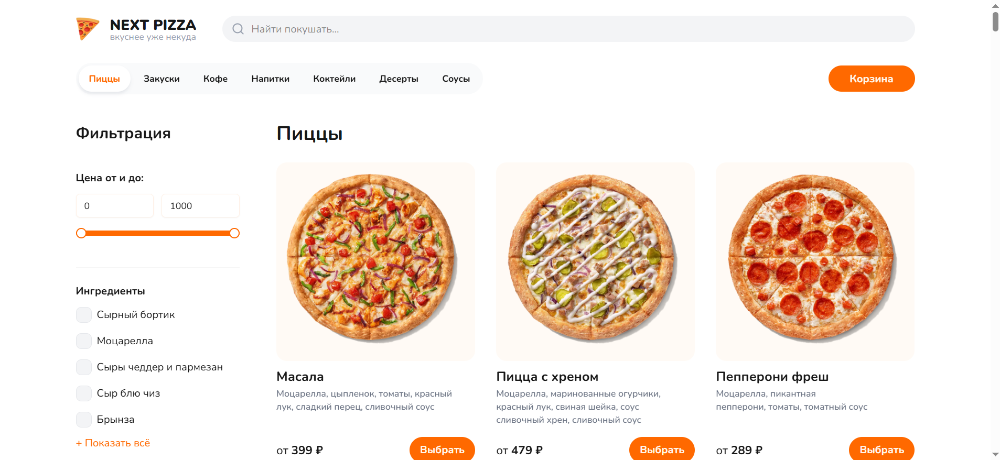
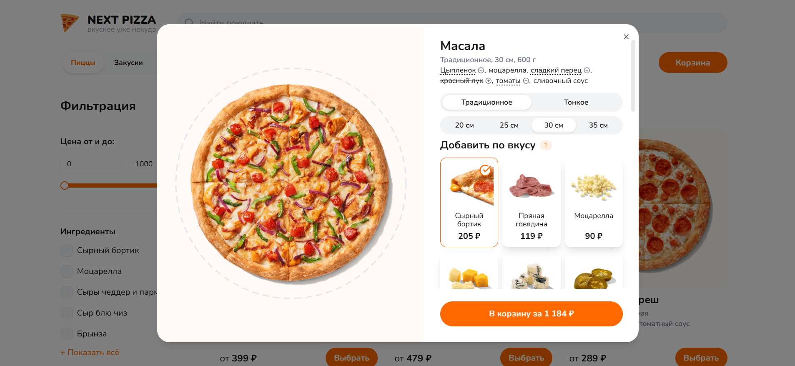
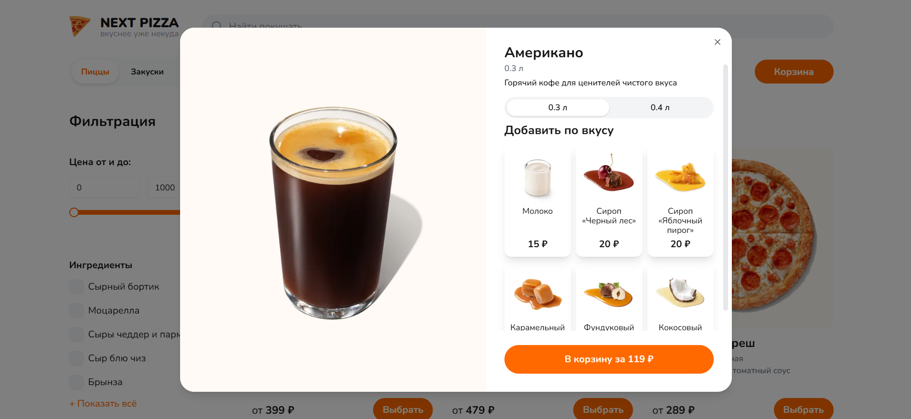
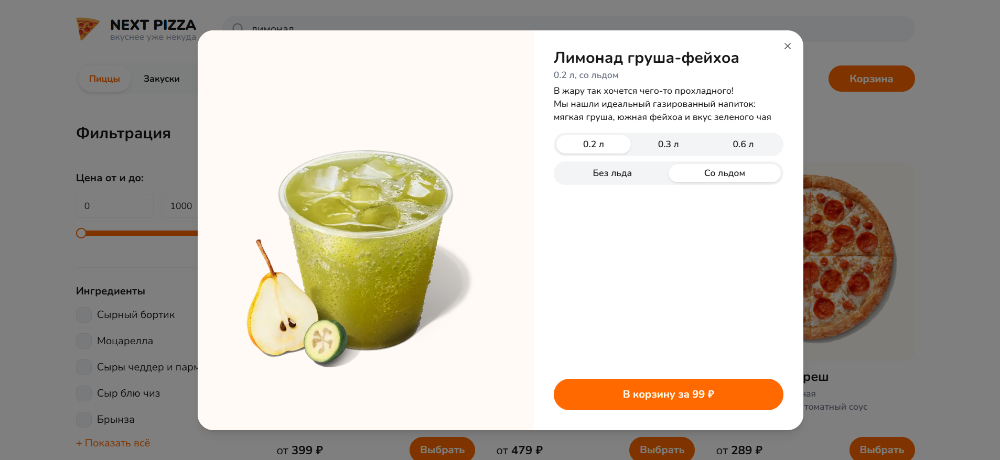
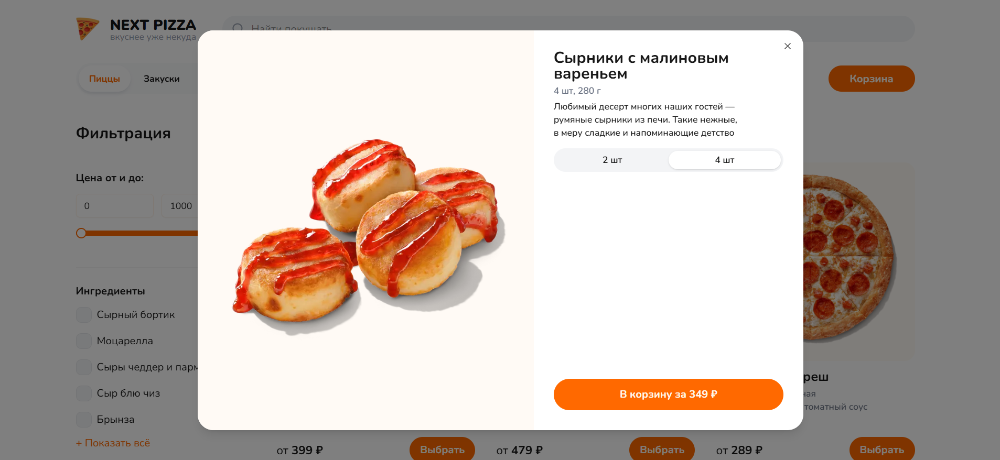
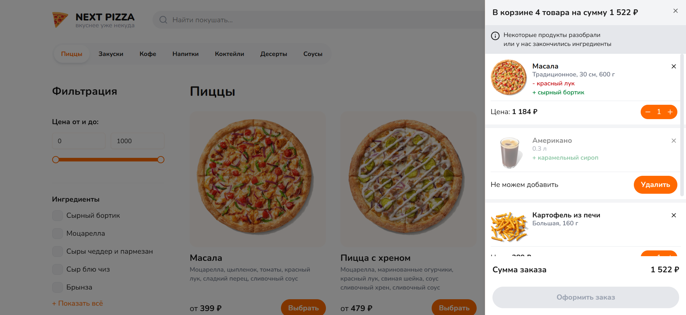
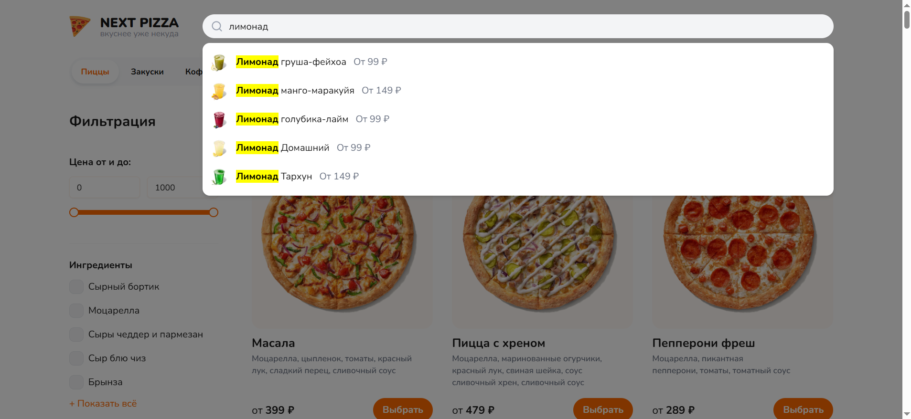

# 🍕 [Next Pizza](https://next-pizza-xi-one.vercel.app/)

Fullstack интернет-магазин пиццы, напитков и других вкусностей.

🌐 Онлайн-демо: https://next-pizza-xi-one.vercel.app/

## ✨ Ключевые фичи

- **Каталог:** пицца, напитки и другие вкусности 
- **Конфигурация товара:** для каждого товара доступны свои параметры и добавки <table><tr><td width="50%"></td><td width="50%"></td></tr><tr><td width="50%"></td><td width="50%"></td></tr></table>
- **Синхронизация корзины с сервером:** перед оформлением заказа проверяется наличие всех товаров 
- **Поиск товаров по названию:** 

## 🚧 В разработке

- Фильтрация товаров (UI есть, логики работы нет)
- Переработка модального окна
- Улучшение дизайна страницы оформления заказа

## 🛠️ Стек

- Next.js 16
- React 19
- TypeScript
- PostgreSQL
- ZenStack
- TanStack React Query
- TanStack Form
- Zod
- Tailwind CSS
- Radix UI
- Biome
- Lefthook
- pnpm
